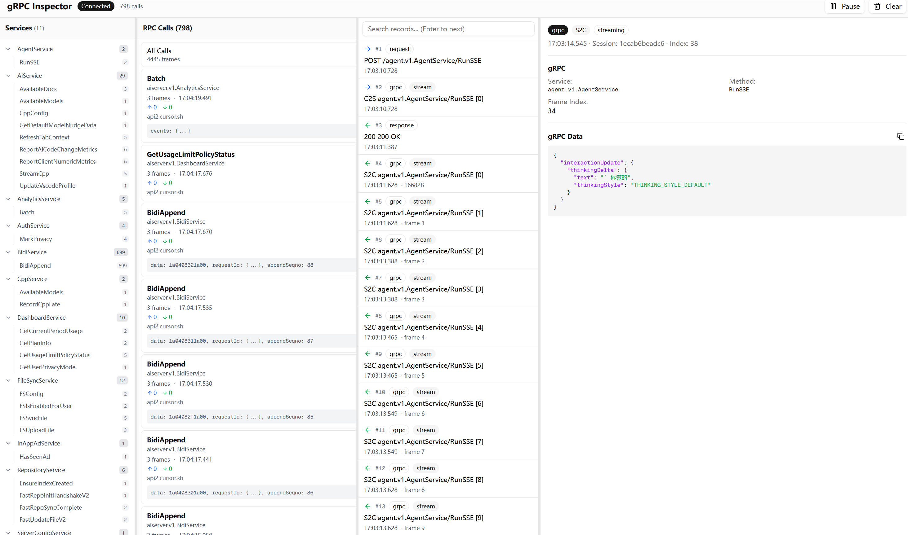

# Cursor-Tap

中文 | [English](./README_EN.md)

Cursor IDE gRPC 中间人流量分析工具。可以解密 TLS、反序列化 protobuf、实时展示 AI 对话产生的RPC请求和响应。



## 为什么做这个

Cursor 和后端的通信全是 gRPC，走的 Connect Protocol，body 是二进制 protobuf。用 Burp 或 Fiddler 抓到的都是一堆看不懂的二进制。官方也没公开 proto 定义，想看 AI 对话的具体内容很麻烦。

这个工具能把流量解密成可读的 JSON，还能实时看到 streaming 的每一帧。

## 相关文章

[Cursor 逆向笔记 1 —— 我是如何拦截解析 Cursor 的 gRPC 通信流量的](./cursor-reverse-notes-1.md)

## 原理

1. **MITM 代理**：在 Cursor 和 api2.cursor.sh 之间插一层，用自签 CA 解密 TLS
2. **Proto 提取**：从 Cursor 客户端的 JS 代码里提取出 proto 定义（藏在 `protobuf-es` 编译产物里）
3. **实时解析**：解析 Connect Protocol 的 envelope framing，反序列化每一帧 protobuf
4. **WebUI 展示**：用 WebSocket 实时推送到前端，四栏布局展示服务树、调用列表、帧列表、详情

## 快速开始

### 1. 启动代理

```bash
go run ./cmd/proxy
```

默认监听 `localhost:8080`（HTTP 代理）和 `localhost:9090`（WebUI + WebSocket）。

### 2. 配置 Cursor

设置环境变量让 Cursor 走代理并信任自签 CA：

```bash
# Windows
set HTTP_PROXY=http://localhost:8080
set HTTPS_PROXY=http://localhost:8080
set NODE_EXTRA_CA_CERTS=C:\path\to\ca.crt

# macOS/Linux
export HTTP_PROXY=http://localhost:8080
export HTTPS_PROXY=http://localhost:8080
export NODE_EXTRA_CA_CERTS=/path/to/ca.crt
```

CA 证书在首次启动时自动生成，位置是 `~/.cursor-tap/ca.crt`。

### 3. 启动 WebUI

```bash
cd web
npm install
npm run dev
```

打开 `http://localhost:3000` 就能看到流量了。

## 项目结构

```
├── cmd/proxy/          # 代理入口
├── internal/
│   ├── ca/             # CA 证书管理，动态签发
│   ├── proxy/          # HTTP CONNECT 代理
│   └── httpstream/     # gRPC 解析核心
│       ├── grpc.go     # protobuf 反序列化
│       ├── parser.go   # Connect Protocol 解析
│       └── recorder.go # 流量记录
├── cursor_proto/       # 提取出来的 proto 定义
└── web/                # Next.js 前端
```

## 能看到什么

- `AiService/RunSSE`：AI 对话的主通道，包括 AI 思考、文本生成、工具调用
- `BidiService/BidiAppend`：用户消息和工具执行结果
- `AiService/StreamCpp`：代码补全请求和建议
- `CppService/RecordCppFate`：补全结果的接受/拒绝反馈
- `AiService/Batch`：用户行为上报
- 其他几十个 RPC 方法...

